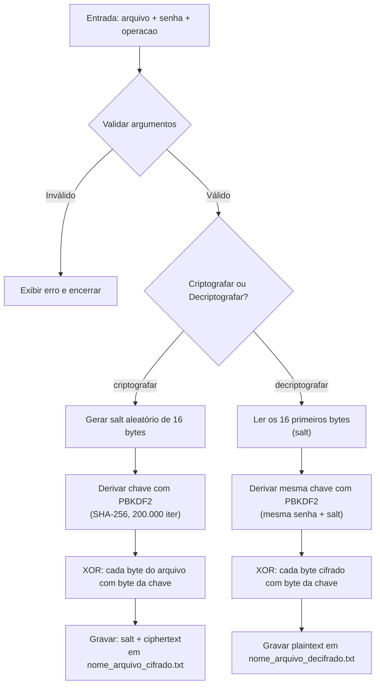

# Cifra de Vernam

> As referências bibliográficas utilizadas na implementação do algoritmo e a declaração de conformidade com a Instrução Normativa nº 16/2026 do IFRS (sobre o uso de IA Generativa no trabalho) encontram-se destacadas logo abaixo para facilitar a avaliação direta.

## Referência Bibliográfica

A implementação do algoritmo da Cifra de Vernam foi baseada na seguinte referência bibliográfica:

STALLINGS, William. **Criptografia e Segurança de Redes**. 6. ed. São Paulo: Pearson Education do Brasil, 2014. p. 35-36.

### Verificação de Alinhamento com a Referência

O algoritmo implementado em `main.py` está em total conformidade com a descrição matemática e operacional da Cifra de Vernam apresentada por William Stallings (2014, p. 35-36):

1. **Operação sobre dados binários**: Conforme o livro indica que a Cifra de Vernam funciona "sobre dados binários (bits), em vez de letras", o script lê, processa e grava os arquivos em modo binário (`rb` e `wb`).
2. **Operação XOR (Ou-Exclusivo)**: A fórmula clássica de cifragem apresentada é `c_i = p_i XOR k_i` e a de decifragem é `p_i = c_i XOR k_i` (onde `c_i` é o dígito binário cifrado, `p_i` é o dígito binário original, e `k_i` é o dígito binário da chave). A minha implementação utiliza a função `_xor_bytes` que realiza o XOR bit a bit entre cada byte da mensagem e a chave (`a ^ b`).
3. **Comprimento da Chave**: Stallings ressalta que o fluxo de chaves (`k_i`) deve ter o mesmo tamanho do fluxo de bits do texto claro (`p_i`). No código, a derivação de chaves via PBKDF2 gera um *keystream* com comprimento exatamente igual ao do arquivo de entrada (`dklen=len(plaintext)`), cumprindo esse requisito do algoritmo.

## Declaração de Uso de Inteligência Artificial Generativa

Em conformidade com a **Instrução Normativa nº 16/2026 do IFRS**, declaro que este trabalho utilizou ferramentas de Inteligência Artificial Generativa em seu desenvolvimento de forma instrumental.

### Modelos Utilizados

* **Claude 4.6 Sonnet**: Utilizado na etapa de planejamento e concepção da arquitetura da solução (*plan*).
* **Codex 5.3**: Utilizado para a implementação prática da arquitetura planejada, atuando como agente de desenvolvimento de software (*agent*).
* **Gemini 3.5 Flash**: Utilizado para a redação da documentação técnica e estruturação deste arquivo `README.md`.

### Extensão do Uso de IA Generativa

A Inteligência Artificial Generativa foi empregada em aproximadamente **40% do desenvolvimento total do trabalho**, concentrando-se especificamente nas seguintes tarefas:

1. **Criação da Documentação**: Estruturação, redação e formatação do arquivo `README.md`.
2. **Melhoria de Comentários no Código**: Revisão e aprimoramento dos comentários internos em `main.py` para torná-los mais claros, didáticos e alinhados às boas práticas de programação.
3. **Implementação de Testes**: Escrita de 20 casos de testes automatizados na pasta `tests/` para validar a implementação.

> **Nota de Conformidade:** Saliento que toda a lógica central do algoritmo foram supervisionadas e validadas diretamente por mim, utilizando como base a literatura técnica de referência (STALLINGS, 2014). Conforme diretriz da IN nº 16/2026 do IFRS, ferramentas de IA generativa foram usadas de forma estritamente instrumental e **não são consideradas fontes de referência bibliográfica**.

## Sobre o Projeto

Implementação em Python da **Cifra de Vernam**. Ela é uma cifra de fluxo que combina cada byte da mensagem com o byte correspondente de uma chave usando XOR bit a bit. A decriptação usa exatamente a mesma operação, pois XOR é sua própria inversa.

Este projeto estende a cifra clássica com **derivação de chave via PBKDF2** e **salt aleatório**, permitindo usar uma senha de tamanho arbitrário para cifrar arquivos de qualquer comprimento.

## Como funciona o algoritmo

### Cifra de Vernam (XOR)

Na Cifra de Vernam original, a chave deve ter o **mesmo tamanho** que a mensagem. Cada byte do texto claro é combinado com o byte correspondente da chave:

```txt
ciphertext[i] = plaintext[i] XOR keystream[i]
```

Para recuperar o texto original, aplica-se o mesmo XOR sobre o ciphertext com o mesmo keystream:

```txt
plaintext[i] = ciphertext[i] XOR keystream[i]
```

### Derivação de chave com PBKDF2

Como a senha informada pelo usuário raramente tem o tamanho exato do arquivo, o script deriva um **keystream** (sequência de bytes) do comprimento necessário usando PBKDF2-HMAC-SHA256:

```python
hashlib.pbkdf2_hmac('sha256', senha, salt, 200_000, dklen=len(plaintext))
```

* **Senha**: convertida para bytes UTF-8 e usada como entrada do PBKDF2.
* **Salt**: 16 bytes aleatórios (`os.urandom(16)`), gerados na cifragem e armazenados no início do arquivo cifrado.
* **Iterações**: 200.000 (aumenta o custo computacional de ataques de força bruta).
* **dklen**: igual ao tamanho do plaintext (ou do ciphertext, na decifragem).

### Fluxo de cifragem e decifragem



## Requisitos

* Python 3.x

## Uso

```bash
python main.py <arquivo> <senha> <operacao>
```

| Argumento  | Descrição                                        |
| ---------- | ------------------------------------------------ |
| `arquivo`  | Caminho do arquivo de entrada (texto ou cifrado) |
| `senha`    | Senha usada para derivar o keystream via PBKDF2  |
| `operacao` | `criptografar` ou `decriptografar`               |

O script valida:

* se foram passados exatamente 3 argumentos (além do nome do script);
* se o arquivo de entrada existe;
* se a operação é `criptografar` ou `decriptografar`.

Em caso de erro, uma mensagem é exibida em `stderr` e o programa encerra com código 1.

## Exemplos de execução

### Cifrar um arquivo de texto

Suponha um arquivo `mensagem.txt` com o conteúdo `Olá, mundo!`.

```bash
$ python main.py mensagem.txt minhaSenha criptografar
Arquivo gravado em: mensagem_cifrado.txt
```

O arquivo `mensagem_cifrado.txt` conterá 16 bytes de salt seguidos dos dados cifrados (ilegíveis em um editor de texto comum).

### Decifrar o arquivo cifrado

Use a **mesma senha** e o arquivo gerado na etapa anterior:

```bash
$ python main.py mensagem_cifrado.txt minhaSenha decriptografar
Arquivo gravado em: mensagem_decifrado.txt
```

O conteúdo de `mensagem_decifrado.txt` será idêntico ao de `mensagem.txt`.

### Exemplo com erro: senha incorreta

Se a senha estiver errada, a decifragem ainda produz um arquivo, mas o conteúdo será lixo (bytes aleatórios), pois o keystream derivado será diferente:

```bash
$ python main.py mensagem_cifrado.txt senhaErrada decriptografar
Arquivo gravado em: mensagem_decifrado.txt
# O arquivo existe, mas o conteúdo não corresponde ao original
```

### Exemplo com erro: argumentos inválidos

```bash
$ python main.py mensagem.txt minhaSenha invalido
Erro: operacao invalida 'invalido'. Use 'criptografar' ou 'decriptografar'.
```

## Formato do arquivo cifrado

O arquivo `_cifrado.txt` é binário e tem a seguinte estrutura:

| Offset       | Tamanho  | Conteúdo                                            |
| ------------ | -------- | --------------------------------------------------- |
| 0–15         | 16 bytes | Salt aleatório (necessário para re-derivar a chave) |
| 16 em diante | restante | Dados cifrados (XOR do plaintext com o keystream)   |

Os arquivos são lidos e gravados em modo binário (`rb`/`wb`), suportando conteúdo de qualquer tamanho, não apenas texto ASCII.

## Convenção de nomenclatura

O script gera automaticamente o nome do arquivo de saída a partir do arquivo de entrada:

| Operação       | Arquivo de entrada  | Arquivo de saída      |
| -------------- | ------------------- | --------------------- |
| criptografar   | `texto.txt`         | `texto_cifrado.txt`   |
| decriptografar | `texto_cifrado.txt` | `texto_decifrado.txt` |

A extensão `.txt` é removida do nome base, o sufixo `_cifrado` ou `_decifrado` é adicionado e a extensão `.txt` é recolocada.

## Melhoria implementada: PBKDF2 com salt aleatório

A Cifra de Vernam clássica exige uma chave pré-compartilhada com o **mesmo comprimento** da mensagem e descartada após o uso (cifra de uso único). Na prática, isso é difícil de operacionalizar com senhas curtas e arquivos grandes.

Esta implementação resolve o problema com duas medidas:

1. **PBKDF2**: deriva um keystream de comprimento arbitrário a partir de uma senha de qualquer tamanho, com 200.000 iterações de SHA-256 para dificultar ataques de força bruta.
2. **Salt aleatório de 16 bytes**: gerado de forma criptograficamente segura (`os.urandom`) a cada cifragem e armazenado no início do arquivo. Isso garante que **dois arquivos cifrados com a mesma senha produzam ciphertexts diferentes**, tornando inviáveis ataques de **rainbow tables** (tabelas pré-computadas de senhas comuns).

## Estrutura do projeto

```txt
cifra-vernam/
├── main.py           # script principal (cifragem, decifragem e CLI)
├── samples/          # arquivos de exemplo para testes de integração
├── tests/            # suíte de testes (unittest, stdlib)
│   ├── test_crypto.py
│   ├── test_paths.py
│   ├── test_files.py
│   └── test_cli.py
└── README.md         # esta documentação
```

## Testes

Na raiz do projeto, execute:

```bash
python -m unittest discover -s tests -v
```

Os testes importam funções diretamente de `main.py` e não exigem dependências além da biblioteca padrão do Python.
